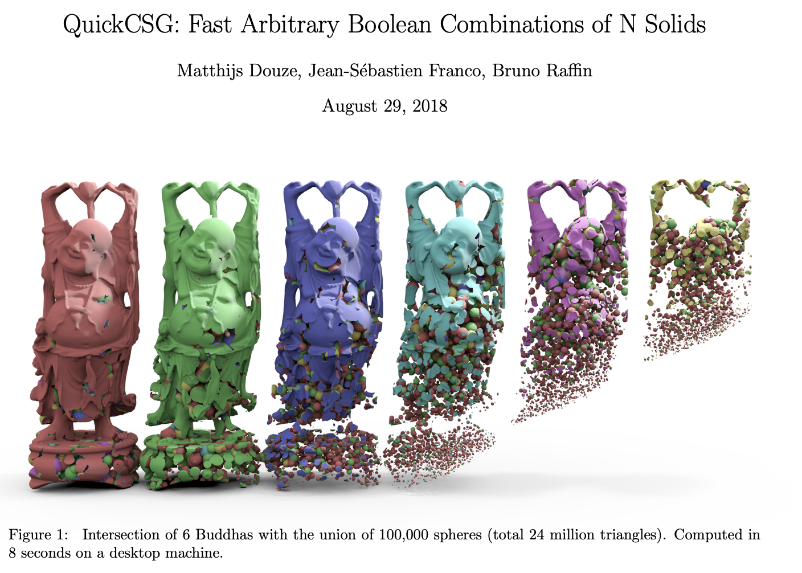
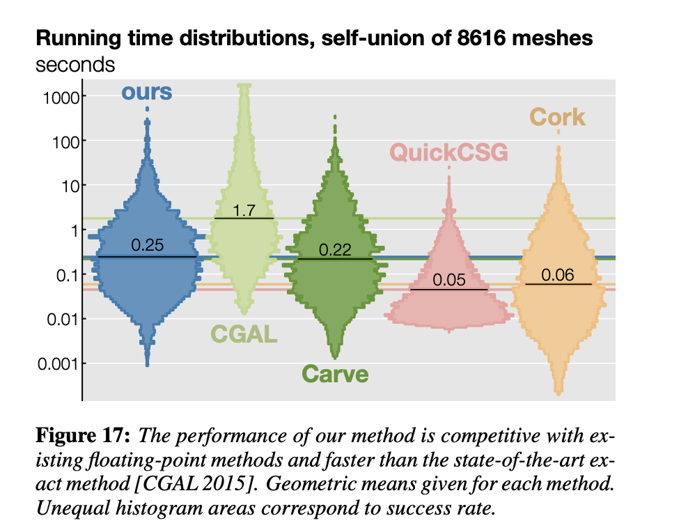

# Summary of progress in the literature search

The problem we are facing at iBurs is to find an efficient, fast and robust way to generate the work piece representation, which is cut by grains iteratively. Our target resolution is to model a 100 mm * 100 mm workpiece, with resolution of 0.1 mm. and the computation should be done on the scale of micro second. However, at the moment we haven't find a efficient library which meets our needs.

So it's necessary to do some research and understand how things are being down in the field of [solid modelling](https://en.wikipedia.org/wiki/Solid_modeling).

## Typical data structure and their application area

The most commoly used data structure in the area of solid modelling is [bounding volume hierarchy](https://en.wikipedia.org/wiki/Bounding_volume_hierarchy) and [binary space partition](https://en.wikipedia.org/wiki/Binary_space_partitioning).

1. BVH:  which divides a 3D volume in small bounding volumes that has very simple shape. BVH is widely used in [collision detection](https://en.wikipedia.org/wiki/Collision_detection) and ray tracing, by traversal through notes/leafs of hierarchy to extract exact notes that’s in collision with each other.

2. BSP: binary space partition: another way of dividing 3D geometry, but different from BVH. It looks like BSP is more applied in mesh Boolean operations. For example, Libigl paper was using BSP as well.

On top of these basic principle, there is also [constructive solid geometry tree (CSGtree)](https://en.wikipedia.org/wiki/Constructive_solid_geometry) and K dimensional tree, the most widely used one is [Octree](https://en.wikipedia.org/wiki/Octree)

1. CSGtree: constructive soils geometry is widely used in CAD programming to construct complicated geometry shape by doing several Boolean operations with primitive shape. It’s optimized for generating complex shape while doing lots of Boolean operations, an example literature in this is: [QuickCSG tree](./QuickCSG_Fast_Arbitrary_Boolean_Combinations_of_N_Solids.pdf). CSGtree is generally faster on a series of Boolean operations, compared to meshes. There is also a field focusing on generating CSGtree from 3D meshes called inverse CSGtree. [MIT has a paper on this topic](./InverseCSG__Automatic_Conversion_of_3D_Models_to_CSG_Trees.pdf).

2. Octree is the most widely used k-dimensional tree structure in the most recent literature. It always subdivides a volume into 8 partition, recursively. Octree seems widely applied in lots of optimized algorithms for speed and robust purposes: [Libigl](./Libigl_Mesh_Arrangements_for_Solid_Geometry.pdf) is using it, [GPU-Voxel](./Unified_GPU_Voxel_Collision_Detection_for_Mobile_Manipulation_Planning.pdf) is using it as well.

## Triangle or Voxel: which is faster

Since the library we explored in 2020 all used the above mentioned algorithms and library, yet they are not fast enough on the calculation we need, as it's shown in this  and . We start to think in other 2 directions: choice of geometry representation and choice of processing unit.

Regarding geometry representations, there are different one to choose: triangles(mesh), voxel, [dexel](./Dexel_Determining_the_Width_and_Depths_of_Cut_in_Milling_on_the_Basis_of_a_Multi_Dexel_Model.pdf), point cloud, etc. But we don’t have enough understanding of pro and cons of each one.

The [sparse Octree voxel paper from Nvedia](./Nvedia_Efficient_Sparse_Voxel_Octrees_–_Analysis_Extensions_and_Implementation.pdf) presented discussion comparing triangles and voxels. It appears voxel takes more memory than triangle. Giving the same color, texture and normal data, voxel takes 3.33 times more memory than Triangle mesh.

## GPU vs CPU

GPU is largely popular in gaming community because of its powerful procedure to render image and graphic effects. GPU is also favored for its parallelization of computation.

The two major GPU framework to use are CUDA and OpenGL. The comparison between these two is not explored yet. However, [in this master thesis](./Parallelization_of_BVH_and_BSP_on_the_GPU.pdf), the limitation of GPU is pointed out:

1. GPU cannot dynamically allocate memory, so before the calculation the memory space needed for storing the geometry should be predefined.
2. GPU is prone to slow and discontinuous read and write.
3. Memory, in this case, memory of OpenCL GPU, is limited.

A more comprehensive comparison is yet to be explored.

## Collision detection vs boolean operations

<!-- One of the confusion in the library search or literature search is, there is apparently 2 different fields of research that are both seems relevant: [collision detection](https://en.wikipedia.org/wiki/Collision_detection) and [boolean operations](https://www.sciencedirect.com/topics/engineering/boolean-operation#:~:text=A%20Boolean%20operation%2C%20such%20as,straightforward%20and%20easy%20to%20implement.&text=It%20inherits%20the%20good%20property,Boolean%20operations%20from%20ray%2Drep.). However, these 2 fields are usually different in the data structure they use. In collision detection, BVH is widely used and applied. In boolean operations on meshes or constructive solid geometry, BSP or  is more applied.

These two fields points to different optimization algorithms. At the moment, we have been focusing on boolean operation perspective. -->

Collision detection has been an heavily research area for several decades. Typical collision detection is performed in the following steps:

1. Broad phase: fast test enumerates all pairs of potentially colliding objects (the so-called potentially collision set (PCS)) to be checked for exact intersection in a second step.
2. Narrow phase: determine exact collision checks between the pairs that intersect. The narrow phase can be further divided into 2 steps: 1) non-overlapping parts of the objects are culled. 2) n accurate collision detection is performed between pairs of geometric primitives that are not culled in the first phase.

Typically different data structures are used in different phases, for each phases, different methods leads to different data structure. 

In the Broad phase, there is topological method and spatial partitioning method:

1. In spatial partitioning method: the most commonly used structures are: BSPtree, Octree, K-d tree, regular grids, hash table,hierarchical spatial hash tables
2. In topological method: the most famous method is Sweep and Prune. They have other data structure used with this method.

In the narrow phase, the most commonly used data structure is BVH. There are also criteria for constructing an optimal BVH and cost functions to compare the efficiency of BVH constructions.

Boolean operation is just part of the narrow phase, when the exact intersection need to be determined and the shape of the object need to be updated.

From the object point of view, the collision detection can be separated for "rigid body" and "deformable object", where the shape of rigid body wouldn't change, while deformable object's shape can be changed during a collision. For example, a piece of cloth colliding with a ball, the ball will be rigid body and the cloth will be deformable object.

There is also various effort on parallizing the computation of collision detection on GPUs. There are several articles collected point to this direction.

The above summary in this section comes from [this book](./Weller2013_Chapter_ABriefOverviewOfCollisionDetec.pdf). Also, another great reference is [this book](./Real_Time_Collision_Detection_by_Christer_Ericson.pdf)

## Related topic to Boolean operation on solid geometry

A similar field or technique that face similar computation problem is [ray tracing](https://en.wikipedia.org/wiki/Ray_tracing_(graphics)). It’s a technique in rendering to generate better and more authentic images.

It’s similar calculation with boolean because when a beam of light meets the 3D geometry, depends on the light is inside or on or outside of geometry, the rendering image looks different.

## Miscellaneous

Another option to power the speed of calculation is using neural network. [This paper](./Sharma_CSGNet_Neural_Shape_CVPR_2018_paper.pdf) proposed a neural net to do constructive solid geometry. But the comparison between this approach with current popular approach on mesh boolean is lacking.
