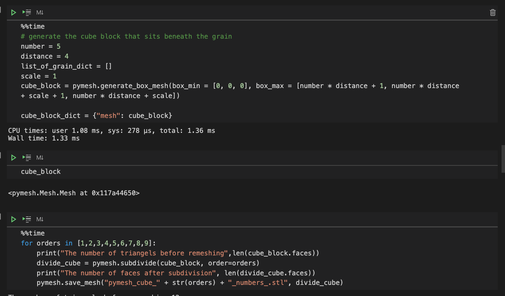
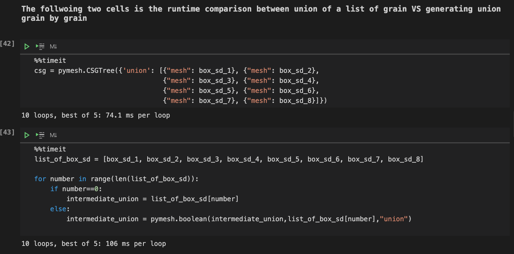
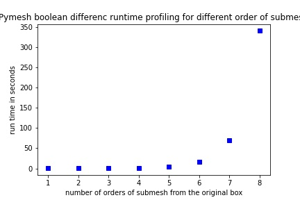

# Here is the latest update on the mesh libraries

## A more precise benchmark on pymesh and ibrus

To properly benchmark the capacity of Pymesh and iBrus, we decided to run test models that matches our resolution requirement in physical experiment. The idea
is to benchmark the runtime performance of these two current libraries or to find a doable resolution that can finish the calculation within 10 minutes.

Following this direction, a [pymesh test script](pymesh_resolution_benchmark.py) is generated to test the performance. But before running this script, several preparation work is done in [Notebook](Notebook_pymesh_efficiency_test.ipynb) to lay the foundation of the test script.

1. Different subdivided box meshes:
The box mesh used in the pymesh test script is first generated as a `pymesh.Box` in the Notebook and different orders of sub-mesh is applied. When the `pymesh.Box` is generated, it has 12 faces. With each order of sub-mesh applied, the number of faces gets x4. And there is no option to only sub-mesh a certain sides of the box. So to meet the resolution of 1000 x 1000 on one face, the following equation is solved to get the desired number of orders:
    12 x 4^n == 2 * 6 * 10^6
which result in n approximately being 10. However, the files generated at order 9 and order 10 are 157.3 MB and 629.1 MB large.

2. The dimension of the cube is fixed to be suitable for 5 * 5 grid of grains. If you want to test new dimension 
of grain grid, check the following section in the [Notebook](Notebook_pymesh_efficiency_test.ipynb):

3. Using CSG.Tree union for grain grid, instead of looping each grain to calculate union:
A short test is conducted in the [Notebook](Notebook_pymesh_efficiency_test.ipynb), it shows the loop method is already slower with 5 boxes .

In the end, a runtime profile for "difference" calculation is plotted against the order of sub-mesh in this graph

## Here stores the developer's note while exploring the mesh libraries

Mesh libraries that provides engine for boolean operations
Candidate:

1. Vedo,  https://github.com/marcomusy/vedo/tree/af7553dc04283e001cb03f910cfaf00f4682eb86
boolean based on VTK. [! VTK]:https://vtk.org/doc/nightly/html/classvtkBooleanOperationPolyDataFilter.html

2. Libigl: https://github.com/libigl
https://libigl.github.io/tutorial/

3. CGAL  https://www.cgal.org/  The problem is this might be too heavy
https://doc.cgal.org/latest/Mesh_3/Mesh_3_2mesh_3D_image_8cpp-example.html

4. Meshlab: https://www.meshlab.net/#references
https://github.com/cnr-isti-vclab/PyMeshLab

